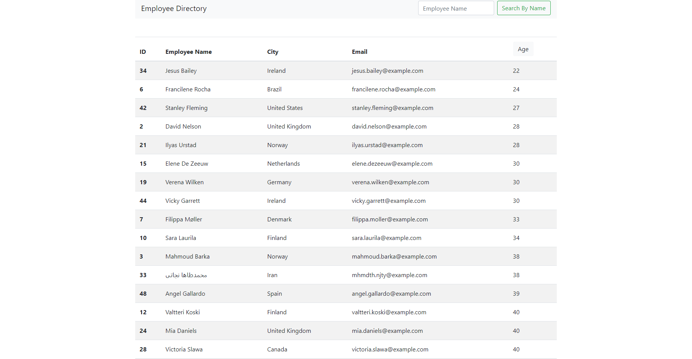

# Employee Directory
  
  ## Description 
  
  This is a react app that will allow you to sort through a table of individuals by age, ascending or descending. It will also allow you to search by name for specific employees. Currently the employees are generated using the randomuser api.
  
  
  ## Table of Contents
  
  * [Installation](#installation)
  * [Usage](#usage)
  * [Contributing](#contributing)
  * [Tests](#tests)
  * [Questions](#questions)
  * [License](#license)
  
  
  ## Installation
  No installation should be necessary, simply click the deployed link. If you would like to make your own version, I would recommend running npx create-react-app and replace the files that it generates with the relevant files from this project. 
  
  
  ## Usage 
  To use this project, click the deployed link below.  https://nmitchell34.github.io/employee_directory/  Click the age column header to sort employees by age, or input a name in the employee name input section and click the search button to filter the list.

  
  
  
  ## Contributing
  Please contribute as much as you'd like.
  
  ## Tests
  There are no tests for this project.
  
  
  ## Questions
  If you have any questions, please reach out to me at: ncm297@gmail.com OR github.com/nmitchell34
  
  
  ## License
  
  This project is licensed under the MIT license.
  
  